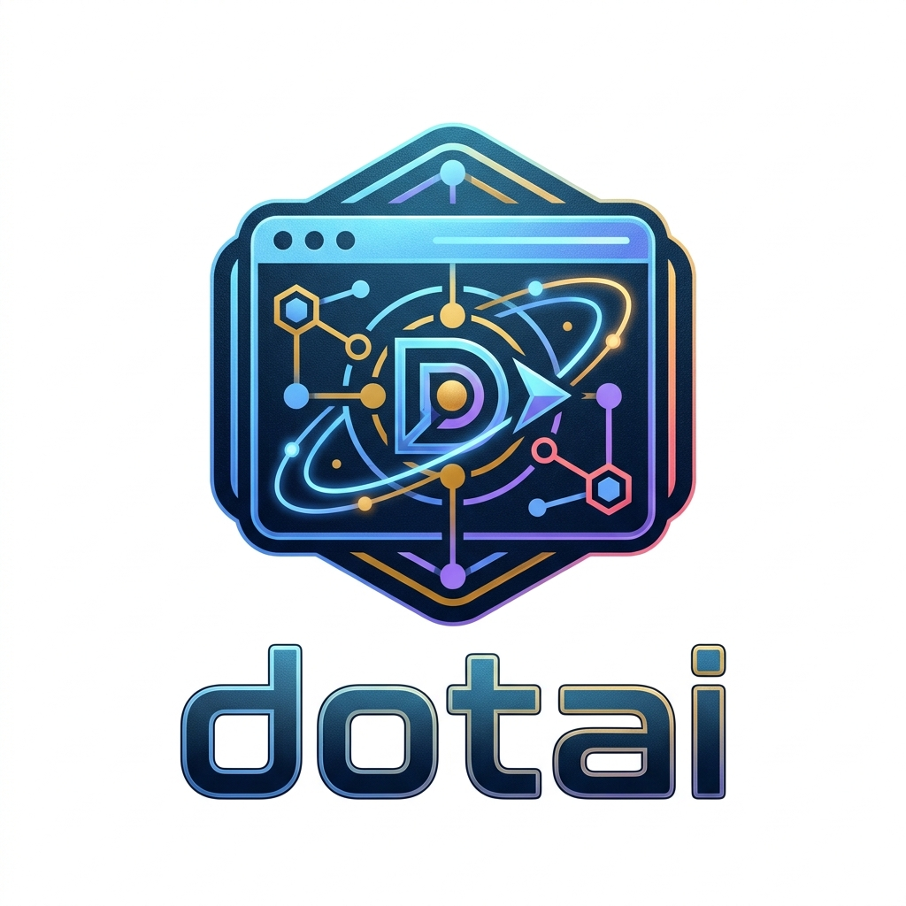

<div align="center">
  

  [](package.json)
  [](LICENSE)
  [](#supported-tools)

  **🤖 One repo to rule all your AI tools — rules, skills, agents, and hooks in sync ✨**

</div>

---

## Overview

**The Pain:** Configuring coding rules, skills, and agent personas across Claude, Cursor, and Copilot means scattered files and constant drift.

**The Solution:** `dotai` is a single source of truth. Edit once, run one script, and every AI tool picks up the changes via symlinks — instantly.

**The Result:** Your AI pair programmer behaves consistently everywhere, with zero manual syncing.

## What's Included

| Type | Path | Purpose |
|------|------|---------|
| 📏 **Rules** | `rules/coding.md` | Coding standards — style, error handling, typing, dependencies |
| 🔧 **Skills** | `skills/<name>/SKILL.md` | Reusable AI capabilities (code review, logo gen, etc.) |
| 🤖 **Agents** | `agents/<name>.md` | Named sub-agent personas (architect, reviewer) |
| 🪝 **Hooks** | `hooks/` | Lifecycle hooks: `session_start`, `task_complete` |

## 🚀 Quick Start

```bash
git clone https://github.com/yourusername/dotai
cd dotai
bash scripts/install.sh
```

That's it. All rules and skills are symlinked into every supported tool's config directory.

## Supported Tools

| Tool | Rules | Skills |
|------|-------|--------|
| Claude Code | `~/.claude/rules/coding.md` | — |
| Cursor | `~/.cursor/rules/coding.mdc` | `~/.cursor/skills/` |
| GitHub Copilot | `~/.config/github-copilot/intellij/global-copilot-instructions.md` | `~/.copilot/skills/` |
| Generic agents | — | `~/.agents/skills/` |

All paths are **symlinks** — edit `rules/coding.md` or a skill once and every tool sees the change immediately.

## Managing Skills

### Add a skill from Git

```bash
npx skills add https://github.com/rknall/claude-skills --skill "SVG Logo Designer"
```

Finds the matching `SKILL.md`, copies it into `skills/<skill-name>/`, records its upstream in `skills/skills.json`, and re-runs `install.sh`. Use `--force` to overwrite an existing skill.

### Update skills to latest upstream

```bash
npx skills update                  # update all tracked skills
npx skills update impeccable       # update one skill by name
```

Re-fetches each skill from its recorded Git source and overwrites the local copy. Runs `install.sh` once at the end. Skills not added via `skills add` are not tracked and will not be updated.

### List tracked skills

```bash
npx skills list
```

Prints all skills recorded in `skills/skills.json` with their upstream repo and the commit SHA they were last installed from.

## Editing Rules

1. Edit `rules/coding.md` — the single source of truth.
2. Run `bash scripts/install.sh` to propagate.

No other steps needed; symlinks keep all tools in sync automatically.

## Repository Structure

```
rules/          Authoritative rule text — edit here
skills/         Reusable skill dirs (focused review passes live under `skills/code-review/<name>/`; install.sh symlinks those as top-level skill names too)
agents/         Named sub-agent persona definitions
hooks/          Lifecycle hook registry and handlers
scripts/
  install.sh    Publishes rules and skills to all tool directories
  skills.mjs    CLI for adding skills from Git repos
```

## Credits

Some skills in this repo were copied from external projects. Attribution:

| Skill | Source |
|-------|--------|
| `baoyu-translate` | [JimLiu/baoyu-skills](https://github.com/JimLiu/baoyu-skills) |
| `hyperframes` | [heygen-com/hyperframes](https://github.com/heygen-com/hyperframes) |
| `impeccable` | [pbakaus/impeccable](https://github.com/pbakaus/impeccable) |
| `logo-generator` | [op7418/logo-generator-skill](https://github.com/op7418/logo-generator-skill) |
| `project-logo-author` | [tsilva/claudeskillz](https://github.com/tsilva/claudeskillz) |
| `project-readme-author` | [tsilva/claudeskillz](https://github.com/tsilva/claudeskillz) |
| `skill-creator` | [anthropics/skills](https://github.com/anthropics/skills) |

Skills are installed via `npx skills add <repo> --skill "<name>"` and live under `skills/` in this repo. If you recognise your work here and attribution is missing or wrong, please open an issue.

## ⭐ Show Your Support

If `dotai` saves you time, give it a star — it helps others find it!
