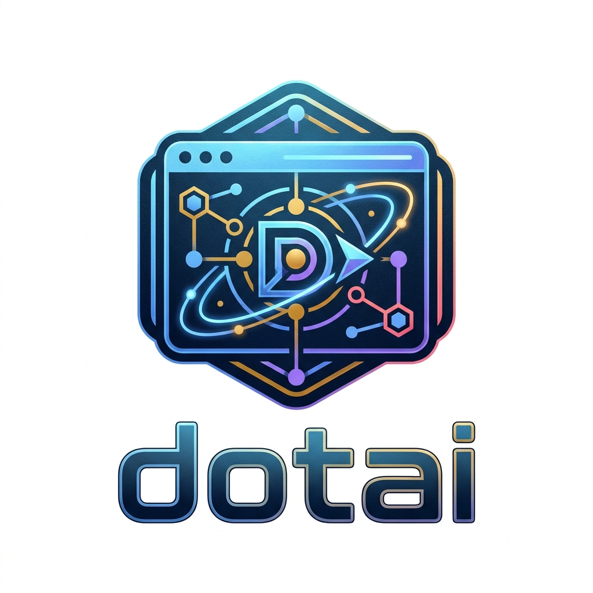

<div align="center">
  

  [](apm.yml)
  [](LICENSE)
  [](#supported-tools)

  **🤖 One repo to rule all your AI tools — rules, skills, agents, and hooks in sync ✨**

</div>

---

## Overview

**The Pain:** Configuring coding rules, skills, and agent personas across Claude, Cursor, and Copilot means scattered files and constant drift.

**The Solution:** `dotai` is a single source of truth. Edit once, run one script, and every AI tool picks up the changes via symlinks — instantly.

**The Result:** Your AI pair programmer behaves consistently everywhere, with zero manual syncing.

## What's Included

| Type | Path | Purpose |
|------|------|---------|
| 📏 **Rules** | `rules/coding.md` | Coding standards — style, error handling, typing, dependencies |
| 🔧 **Skills** | `skills/<category>/<name>/SKILL.md` | Skills authored here |
| 📦 **Dependencies** | `apm.yml` | Upstream skills and MCP servers, pinned in `apm.lock.yaml` |
| 🤖 **Agents** | `agents/<name>.md` | Named sub-agent personas (architect, reviewer) |
| 🪝 **Hooks** | `hooks/` | Lifecycle hooks: `session_start`, `task_complete` |

## 🚀 Quick Start

```bash
git clone https://github.com/yourusername/dotai
cd dotai
apm install                 # fetch pinned upstream skills + MCP servers
bash scripts/install.sh     # publish everything to your tools
```

That's it. All rules and skills are symlinked into every supported tool's config directory.

Requires [APM](https://github.com/microsoft/apm). If your network blocks SSH to
GitHub, run `apm config set allow-protocol-fallback true` once so clones fall
back to HTTPS.

## Supported Tools

| Tool | Rules | Skills |
|------|-------|--------|
| Claude Code | `~/.claude/rules/coding.md` | `~/.claude/skills/` |
| Cursor | `~/.cursor/rules/coding.mdc` | `~/.cursor/skills/` |
| GitHub Copilot | `~/.config/github-copilot/intellij/global-copilot-instructions.md` | `~/.copilot/skills/` |
| Generic agents | — | `~/.agents/skills/` |

All paths are **symlinks** — edit `rules/coding.md` or a skill once and every tool sees the change immediately.

## Managing Skills

Skills come from three places, all published the same way — as `{category}.{name}`
symlinks in every tool directory:

| Source | Lives in | Managed by |
|--------|----------|------------|
| Authored here | `skills/<category>/<name>/` | you, directly |
| Upstream repos | `apm_modules/` (gitignored) | `apm.yml` + `apm.lock.yaml` |
| Another local repo | symlinked into `skills/<category>/` | `external-skills.conf` |

### Add a skill from an upstream repo

```bash
apm install pbakaus/impeccable#<sha> --skill impeccable
```

Then give it a category in `vendored-skills.conf` and run `bash scripts/install.sh`.
APM pins the resolved commit and every file hash in `apm.lock.yaml`; the category
file decides where the skill lands. Skills are matched by the `name:` in their
SKILL.md frontmatter, so a repo whose directory name differs still resolves.

Repos without a skill manifest (no `plugin.json`) reject `--skill` — install the
whole repo and let `vendored-skills.conf` select what gets published.

### Update, inspect, verify

```bash
apm outdated                     # what has drifted from upstream
apm update                       # refresh refs and rewrite the lockfile
apm install                      # install what the lockfile pins
apm audit                        # detect tampering with fetched files
bash scripts/install.sh --list   # every skill and the source it resolves to
bash scripts/verify-skills-layout.sh
```

### Add a skill you author yourself

Create `skills/<category>/<name>/SKILL.md` and run `bash scripts/install.sh`.
No registration step — the directory layout is the declaration.

## Editing Rules

1. Edit `rules/coding.md` — the single source of truth.
2. Run `bash scripts/install.sh` to propagate.

No other steps needed; symlinks keep all tools in sync automatically.

## Restoring Claude Code Sessions

`claude-tabs` reopens the Claude Code sessions you had running — after a reboot, a closed
window, or a crashed terminal — each in its own zellij tab, in its own working directory,
resumed in place.

```bash
claude-tabs save                # snapshot the sessions open right now
claude-tabs list                # live sessions, and what a restore would do
claude-tabs restore             # reopen them as zellij tabs
claude-tabs restore --dry-run   # print the plan and the layout, change nothing
```

Sessions already running are skipped, so `restore` is safe to run twice. Entries whose
working directory or transcript has since disappeared are reported and skipped rather than
opened into a tab that would fail.

Reads Claude Code's own live-session registry (`~/.claude/sessions/`); the snapshot lands in
`~/.claude/open-sessions.json`. Requires `jq`, `zellij`, and Linux `/proc`.

## Repository Structure

```
rules/                 Authoritative rule text — edit here
skills/                Skills authored here, by category (code/, docs/, creative/, utils/)
apm.yml                Upstream skill and MCP server dependencies
apm.lock.yaml          Resolved commits and file hashes — commit this
apm_modules/           Fetched upstream repos (gitignored, rebuilt by apm install)
vendored-skills.conf   Which category each apm_modules/ skill is published under
external-skills.conf   Machine-local: skill directories owned by another repo
agents/                Named sub-agent persona definitions
hooks/                 Lifecycle hook registry and handlers
scripts/
  install.sh              Publishes rules and skills to all tool directories
  sync.sh                 git pull + apm install + install.sh
  verify-skills-layout.sh Checks the published layout matches what install.sh resolves
  claude-tabs.sh          Saves and restores open Claude Code sessions as zellij tabs
```

## Credits

Some skills in this repo were copied from external projects. Attribution:

| Skill | Source |
|-------|--------|
| `code.clean-code-principles` | [AsyrafHussin/agent-skills](https://github.com/AsyrafHussin/agent-skills) |
| `code.impeccable` | [pbakaus/impeccable](https://github.com/pbakaus/impeccable) |
| `creative.baoyu-translate` | [JimLiu/baoyu-skills](https://github.com/JimLiu/baoyu-skills) |
| `creative.hyperframes` | [heygen-com/hyperframes](https://github.com/heygen-com/hyperframes) |
| `creative.logo-generator` | [op7418/logo-generator-skill](https://github.com/op7418/logo-generator-skill) |
| `creative.project-logo-author` | [tsilva/claudeskillz](https://github.com/tsilva/claudeskillz) |
| `docs.project-readme-author` | [tsilva/claudeskillz](https://github.com/tsilva/claudeskillz) |
| `mattpocock.diagnosing-bugs` | [mattpocock/skills](https://github.com/mattpocock/skills) |
| `mattpocock.grill-with-docs` | [mattpocock/skills](https://github.com/mattpocock/skills) |
| `mattpocock.improve-codebase-architecture` | [mattpocock/skills](https://github.com/mattpocock/skills) |
| `mattpocock.prototype` | [mattpocock/skills](https://github.com/mattpocock/skills) |
| `mattpocock.setup-matt-pocock-skills` | [mattpocock/skills](https://github.com/mattpocock/skills) |
| `mattpocock.tdd` | [mattpocock/skills](https://github.com/mattpocock/skills) |
| `mattpocock.to-spec` | [mattpocock/skills](https://github.com/mattpocock/skills) |
| `mattpocock.to-tickets` | [mattpocock/skills](https://github.com/mattpocock/skills) |
| `mattpocock.triage` | [mattpocock/skills](https://github.com/mattpocock/skills) |
| `utils.skill-creator` | [anthropics/skills](https://github.com/anthropics/skills) |

These skills are fetched from their upstream repos by `apm install` and are not copied into this repo. If you recognise your work here and attribution is missing or wrong, please open an issue.

## ⭐ Show Your Support

If `dotai` saves you time, give it a star — it helps others find it!
